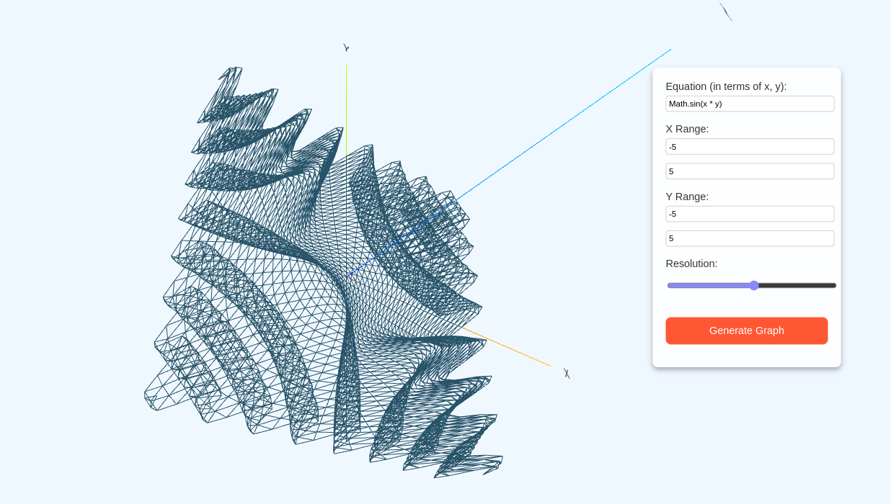

# SimuLab

SimuLab is an interactive web application designed to visualize and simulate various scientific and mathematical concepts in an engaging way. With a focus on STEM (Science, Technology, Engineering, and Mathematics) education, SimuLab provides dynamic simulations for concepts such as projectile motion, sorting algorithms, pendulum motion, gravitational forces, and more.

## Features

- **Interactive Simulations**: Visualize physics and mathematical concepts such as projectile motion, pendulum motion, gravitational forces, and 3D graphing.
- **Sorting Algorithms Visualization**: Explore sorting algorithms like Bubble Sort and Insertion Sort with interactive visualizations.
- **Real-Time Data Updates**: View step-by-step changes in the simulation as it progresses.
- **User-Friendly Interface**: Clean and simple controls for interaction and simulation management.
- **Open-Source**: Free and open to contributions, with the goal of providing educational tools for students, educators, and developers.

## Simulations

1. **Projectile Motion**
   - Visualize the trajectory of a projectile based on its initial velocity, angle, and gravitational force.
   - Parameters: Initial velocity, launch angle, gravity.
   
   

2. **Pendulum Motion**
   - Simulate the motion of a pendulum under the influence of gravity.
   - Parameters: Length of the pendulum, gravitational force.

3. **Gravitational Force**
   - Visualize the gravitational force between two masses (e.g., Earth and the Moon) based on their mass and distance apart.
   - Parameters: Mass of both objects, distance between them, gravitational constant.
   

4. **3D Graphing**
   - Plot 3D mathematical functions.
   - Parameters: Mathematical function (e.g., x^2 + y^2), x and y ranges, resolution.
   
   

5. **Sorting Algorithms**
   - Visualize sorting algorithms such as Bubble Sort and Insertion Sort, with real-time updates on array states.
   - Parameters: Array values (for sorting).
   
   

## Getting Started

To run SimuLab locally, follow these steps:

### Prerequisites

- **Node.js** (v14 or higher)
- **npm** (Node Package Manager)
- *"python** (v3 or higher)

### Installing

1. Clone the repository:
    ```bash
    git clone https://github.com/dipankarchettri/SimuLab.git
    ```

2. Navigate into the project folder:
    ```bash
    cd SimuLab
    ```

3. Install the dependencies:
    ```bash
    npm install
    ```

4. Run the development server:
    ```bash
    npm start
    ```

    This will launch the application on `http://localhost:3000` by default.

## Contributing

Contributions are welcome! If you'd like to contribute to SimuLab, feel free to fork the repository and create a pull request. Here’s how you can help:

- Fix bugs or issues
- Improve the UI/UX
- Add more simulations and visualizations
- Improve documentation

Please make sure to follow the existing code style and write clear, concise commit messages.

## Contact

For any questions or feedback, feel free to reach out to me directly:

- **Email**: dipankarchettri12345@gmail.com
- **GitHub**: [@dipankarchettri](https://github.com/dipankarchettri)
